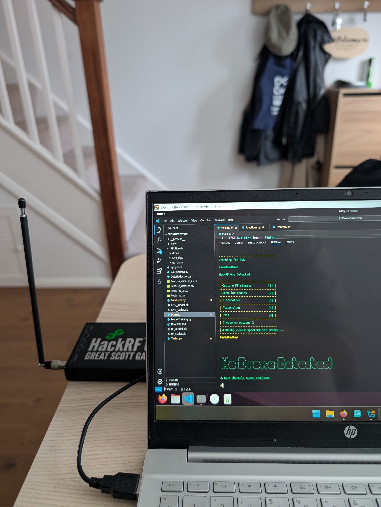
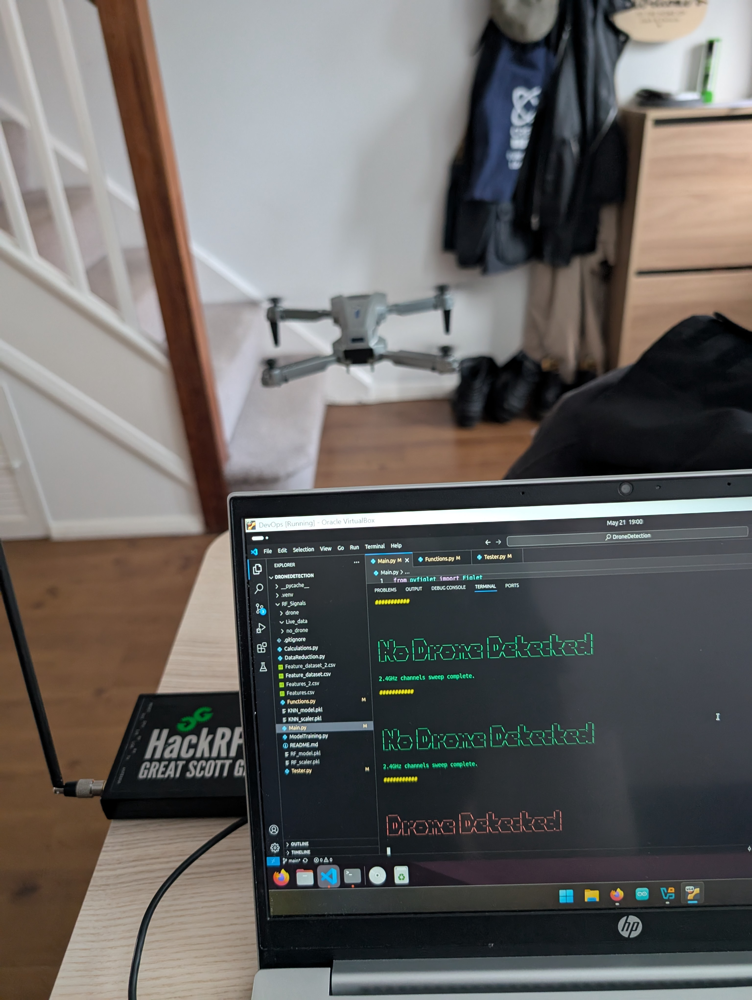

## Drone Detector

--- 

#### The goal of this project is to incorporate ML and AI with an embedded system to detect the presence of a drone then to use infrared sensoring to locate the drone.  

#### The working idea of this project will be the following

- **Use SDR to monitor the spectrum used by drone, 2.4GHz**
- **Use a trained ML model to detect a drone from its RF signature**
- **Swap program to an IR camera which uses AI object tracking to locate the drone**

##### Once a drone has been detected and located the camera will continue to track it untill stopped

---
### Equipment

- Raspberry Pi 5 4Gb
- Raspberry Pi AI HAT+ 16tops with Hailo chip
- HackRF One and ANT500 antenna
- Raspberry Pi camera module 3 noIR
- Waveshare 4.3" touch screen
- Wireless mini keyboard 

--- 

### Development phases

#### Phase 1:

- Collecting drone RF data **Completed**
- Collecting RF background noise **Completed**
- Train and evaluate ML models for performance **Completed**
- Test with live drone **Completed**

#### Phase 2:

- Set up Ai HAT+ and camera module                           **Completed**
- Setup and test object detection with YOLOv8 or latest      **Completed** 
- Collect IR images of drones                                **Completed**
- Label images and train YOLO model                          **Completed**

#### Phase 3:

- Move all programs onto raspberry Pi and test all equipment **Completed**
- Test equipment and program on the Pi                       **Completed**
- Develop a final program                                    **Completed**
- Live tests with drone                                      **Completed**

--- 

### Progress

#### Drone RF capture:
- 500 RF signals captured from a 2.4GHz drone and 500 signals of bakground noise
- Program sweep scans the 2.4GHz range using WiFi channels drones use to communicate on
- Drones communicate on the 802.11 standard and use FHSS to hop between wifi channels, to capture the range I chose to scan all freqencies and extract the feautres.
- Feature extraction program integrated with sweep function, when running each channel is scanned, exported and features extarcted and saved to a CSV file
- Intial model training shows around 80% accuracy on Random Forest, Desicion Tree, KNN and SVM. Parameter tuning is underway 

#### ML outcomes:
- Training, tuned and evaluted models have the following scores: 
    **Random Forest accuracy: 0.9356,**
    **Decision Tree accuracy: 0.8911,**
    **SVM accuracy: 0.9257,**
    **KNN accruacy: 0.9356,**
 

#### AI Training:
- images captured by using Python to automate image capture everyy 5 seconds as the drone flies
- over 200 images of the drone in various positions and lighting conditions taken
- images taken without the drone used as background and unlabeled images
- Label-Studio was used to label each image of drone
- YOLOv8n model was trained on this data set
- Converted .pt to .onnx
- itergrated with Hailo software by converting the onnx to a hef file the Hailo chip can use
- tests show the drone is successfuly tracked

#### Testing:
- 
- 
- 

